```{r, echo=T, message=F, warning=F}
#libraries used
if (!require('knitr')) install.packages('knitr')
if (!require('tidyverse')) install.packages('tidyverse')
if (!require('VennDiagram')) install.packages('VennDiagram')
if (!require('gridExtra')) install.packages('gridExtra')
```

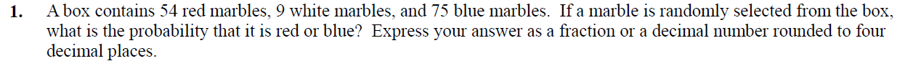

**_Solution:_**

Number of red marbles $R$ = 54

Number of white marbles $W$ = 9

Number of blue marbles $B$ = 75

Total marbles = $R$ + $W$ + $B$ = $54 + 9 + 75$ = $`r 54 + 9 + 75`$

Probability of selecting red marble $P(R)$ = $\frac{54}{`r 54 + 9 + 75`}$ = $`r round(54/(54 + 9 + 75),4)`$

Probability of selecting white marble $P(W)$ = $\frac{9}{`r 54 + 9 + 75`}$ = $`r round(9/(54 + 9 + 75),4)`$

Probability of selecting blue marble $P(B)$ = $\frac{75}{`r 54 + 9 + 75`}$ = $`r round(75/(54 + 9 + 75),4)`$

Probability of selecting red or blue $P(R or B)$ = $P(R) + P(B)$ = $\frac{54}{`r 54 + 9 + 75`}$ + $\frac{75}{`r 54 + 9 + 75`}$ = $`r round(54/(54 + 9 + 75),4) + round(75/(54 + 9 + 75),4)`$

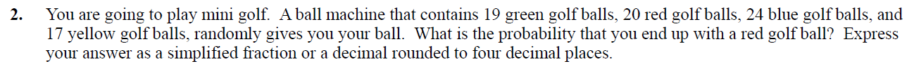

**_Solution:_**

Number of green golf balls $G$ = 19

Number of red golf balls $R$ = 20

Number of blue golf balls $B$ = 24

Number of yellow golf balls $Y$ = 17

Total golf balls = $G$ + $R$ + $B$ + $Y$ = $19 + 20 + 24 + 17$ = $`r 19 + 20 + 24 + 17`$

Probability of getting red golf ball $P(R)$ = $\frac{20}{`r 19 + 20 + 24 + 17`}$ = $`r round(20/(19 + 20 + 24 + 17),4)`$

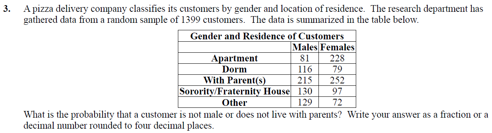

**_Solution:_**

Calculate percentages,

```{r, echo=T}
#create matrix
customer.data<- matrix(c(81,228, 116,79, 215,252, 130,97, 129,72),ncol=2,byrow=TRUE)
colnames(customer.data)<- c("Males","Females")
rownames(customer.data)<- c('Apartment', 'Dorm', 'With Parent(s)', 'Sorority/Fraternity House', 'Other')

#bind column and row totals
customer.data<- cbind(customer.data, Total = rowSums(customer.data))
customer.data<- rbind(customer.data, Total = colSums(customer.data))

#calculate percentages
customer.data.percentages<- round((customer.data/1399),4)
kable(customer.data.percentages, format="pandoc", align="l", caption = "Gender and Residence of Customers by Percentages")
```

Probability that a customer is not male can be calculated both ways, 

- Probability customer is female $P(C_{gender = female})$, percentage of female customers

$P(C_{gender = female}) = `r customer.data.percentages['Total','Females']`$

- Probability customer is not male $P(C_{gender \ne male}) = 1 - P(C_{gender = male})$

$P(C_{gender \ne male}) = 1 - `r customer.data.percentages['Total','Males']` = `r 1 - customer.data.percentages['Total','Males']`$

Since gender is complement event, not male equals female, $P(C_{gender \ne male}) = P(C_{gender = female}) = `r customer.data.percentages['Total','Females']`$ 

Probability customer does not live with parents $P(C_{residence \ne parents})$ = $P(C_{residence=apartment}) + P(C_{residence=dorm}) + P(C_{residence=sorority/fraternity}) + P(C_{residence=other})$ = $1 - P(C_{residence = parents})$ = $1 - `r customer.data.percentages['With Parent(s)','Total']`$ = $`r 1 - customer.data.percentages['With Parent(s)','Total']`$

Probability customer is not male or does not live with parents = $P(C_{gender\ =\ female}) + P(C_{residence \ne parents}) - (P(C_{female,apartment}) + P(C_{female,dorm}) + P(C_{female,sorority/fraternity}) + P(C_{female,other}))$

Reason we have substract $P(C_{female,apartment}) + P(C_{female,dorm}) + P(C_{female,sorority/fraternity}) + P(C_{female,other})$ is because values are counted twice. Once in $P(C_{gender=female})$ and $P(C_{Residence \ne Parents})$, contains both males and females.

$P(C_{gender = female}) + P(C_{Residence \ne Parents}) - (P(C_{female,apartment}) + P(C_{female,dorm}) + P(C_{female,sorority/fraternity}) + P(C_{female,other}))$

= $`r customer.data.percentages['Total','Females']` + `r 1 - customer.data.percentages['With Parent(s)','Total']` - (`r customer.data.percentages['Apartment','Females']` + `r customer.data.percentages['Dorm','Females']` + `r customer.data.percentages['Sorority/Fraternity House','Females']` + `r customer.data.percentages['Other','Females']`)$

= $`r customer.data.percentages['Total','Females'] + (1 - customer.data.percentages['With Parent(s)','Total']) - ( customer.data.percentages['Apartment','Females'] + customer.data.percentages['Dorm','Females'] + customer.data.percentages['Sorority/Fraternity House','Females'] + customer.data.percentages['Other','Females'])`$

Therefore, Probability customer is not a male or does not live with parents = $`r customer.data.percentages['Total','Females'] + (1 - customer.data.percentages['With Parent(s)','Total']) - ( customer.data.percentages['Apartment','Females'] + customer.data.percentages['Dorm','Females'] + customer.data.percentages['Sorority/Fraternity House','Females'] + customer.data.percentages['Other','Females'])`$

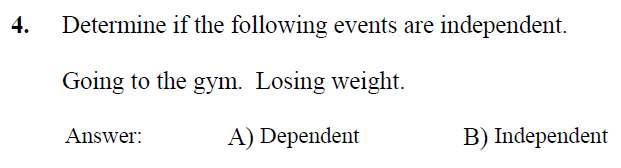

**_Solution:_**

By definition, two processes are independent if knowing the outcome of one provides no useful information about the outcome of the other.

Going to gym and exercising may result in losing weight. On the other hand, a person can lose weight without going to a gym and just controlling calorie intake. NY Times article explains it, 
https://www.nytimes.com/2015/06/16/upshot/to-lose-weight-eating-less-is-far-more-important-than-exercising-more.html 

In other words, there is some correlation between going to the gym and losing weight. However, it does not demonstrate a casual relation between weight loss and going to the gym. 

Hence both events are independent.

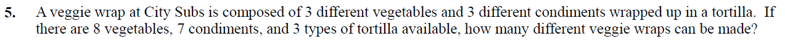

**_Solution:_**

Number of vegetables $V$ = 8

Number of condiments $C$ = 7

Variety of tortillas available  $T$ = 4

To make a veggie wrap we need $W = T  + 3V + 3C$

Combination of 3 vegetables from 8 available choices = $C(8,3)$ = $8_{C_3}$ = $\frac{8!}{3!(8-3)!}$ = $\frac{8*7*6*5!}{(3*2*1)(5!)}$ = $`r choose(8,3)`$

Combination of 3 condiments from 7 available choices = $C(7,3)$ = $7_{C_3}$ = $\frac{7!}{3!(7-3)!}$ = $\frac{7*6*5*4!}{(3*2*1)(4!)}$ = $`r choose(7,3)`$

Veggie wrap $W$ = (Combination of 3 vegetables from 8 available choices) X (Combination of 3 condiments from 7 possible options) X (Choice of tortilla)

$W$ = $`r choose(8,3)`$ * $`r choose(7,3)`$ * $4$

$W$ = $`r choose(8,3) * choose(7,3) * 4`$

Therefore, we can make a total of $`r choose(8,3) * choose(7,3) * 4`$ veggie wraps.

Using _R_ functions,

```{r, echo=T, warning=F, message=F}
#vegetables
#available choices 8, can be used to make wrap 3
#combination
v<- choose(8,3)

#condiments
#available choices 7, can be used to make wrap 3
#combination
c<- choose(7,3)

#choice of tortilla = 4
t<- 4
#number of veggie wraps
w<- v*c*t

#vegetables
veg<- c('V1','V2','V3','V4','V5','V6','V7','V8')
veg.combination<- apply(t(combn(veg, 3)), 1, paste, collapse="+")
veg.combination<- data.frame(V=veg.combination,stringsAsFactors = F)

#condiments
con<- c('C1','C2','C3','C4','C5','C6','C7')
con.combination<- apply(t(combn(con, 3)), 1, paste, collapse="+")
con.combination<- data.frame(C=con.combination,stringsAsFactors = F)

#tortilla
tor.combination<- data.frame(T = c('T1','T2','T3','T4'))

wrap<- tor.combination %>% 
  expand(tor.combination, V = veg.combination$V, C = con.combination$C) %>%
  select(`T`,V,C)

randomRows<- sample(1:length(wrap[,1]), 20, replace=T)
wrap %>% slice(randomRows) %>%
  kable (col.names = c("Tortilla Variety", "Vegetables Combination", "Condiments Combination"), caption = 'City Subs Menu')
```

Total veggie wraps = $`r w`$

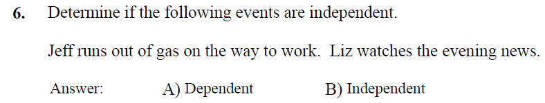

**_Solution:_**

Jeff and Liz are two different people. It is not possible to analyze 

- Liz watches the evening news because Jeff runs out of gas on the way to work.
- Jeff runs out of gas on the way to work because Liz watches the evening news.

As there is no causation or correlation between two events, they are _independent_.

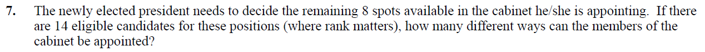

**_Solution:_**

Cabinet positions to be filled $CP$ = 8

Available eligible candidates $A$ = 14

Combination of 8 candidates from 14 available choices = $C(14,8)$ = $14_{C_8}$ = $\frac{14!}{8!(14-8)!}$ = $\frac{14*13*12*11*10*9*8!}{(8!)(6!)}$ = $`r choose(14,8)`$

Total number of different ways members of the cabinet can be appointed = $`r choose(14,8)`$

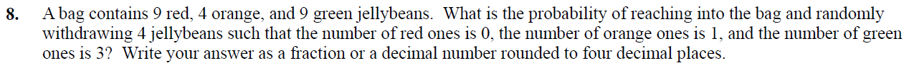

**_Solution:_**

Number of red jellybeans $R$ = 9

Number of orange jellybeans $O$ = 4

Number of green jellybeans $G$ = 9

Total jellybeans = $R$ + $O$ + $G$ = $9 + 4 + 9$ = $`r 9 + 4 + 9`$

The event of withdrawing four jellybeans is _dependent event_. In other words, selecting orange or green jellybean first effect second outcome. The event is also referred to as choosing _without replacement_. Which means once orange jellybean is selected, it is not put back into the bag while selecting the second jellybean.

Probability of selecting green jellybeans on first draw $P(G_1)$ = $\frac{9}{`r 9 + 4 + 9`}$ = $`r round(9/(9 + 4 + 9),4)`$

After the first draw, we are left with 21 jellybeans and eight green jellybeans, if the first draw was green jellybean

Probability of selecting green jellybeans on second draw $P(G_2)$ = $\frac{8}{`r 8 + 4 + 9`}$ = $`r round(8/(8 + 4 + 9),4)`$

On the third draw, we are left with 20 jellybeans and seven green jellybeans, if first and second draws resulted in green jellybean

Probability of selecting green jellybeans on third draw $P(G_3)$ = $\frac{7}{`r 7 + 4 + 9`}$ = $`r round(7/(7 + 4 + 9),4)`$

On fourth draw, we are left with 19 jellybeans,

Probability of selecting orange jellybeans $P(O)$ = $\frac{4}{`r 6 + 4 + 9`}$ = $`r round(4/(6 + 4 + 9),4)`$

Since, this probability can happen four different ways $\{OGGG, GOGG, GGOG, GGGO\}$, multiply the resulting probability with 4.

Therefore, probability of selecting one orange and three green jellybeans = $4 * P(G_1) * P(G_2) * P(G_3) * P(O)$ = $4 * \frac{9}{`r 9 + 4 + 9`} * \frac{8}{`r 8 + 4 + 9`} * \frac{7}{`r 7 + 4 + 9`} * \frac{4}{`r 6 + 4 + 9`}$ = $`r round(4 * (9/(9 + 4 + 9)) * (8/(8 + 4 + 9)) * (7/(7 + 4 + 9)) * (4/(6 + 4 + 9)),4)`$

Using _combinations method_,

Probability that event occurs, $P(E) = \frac{size\ of\ event\ space}{size\ of\ sample\ space}$

There are 3 ways to select green jellybeans = $9_{C_3}$ = $\frac{9!}{3!(9-3)!}$ = $`r choose(9,3)`$

One way to select orange jellybean = $4_{C_1}$ = $\frac{4!}{1!(4-1)!}$ = $`r choose(4,1)`$

Event space = $9_{C_3} * 4_{C_1}$ = $`r choose(9,3) * choose(4,1)`$

Different ways to select 4 jellybeans, Sample space = $22_{C_4}$ = $`r choose(22,4)`$

Therefore, probability of selecting one orange and three green jellybeans = $\frac{\bigg(9_{C_3}\bigg) * \bigg(4_{C_1}\bigg)}{\bigg(22_{C_4}\bigg)}$ = $`r round((choose(9,3) * choose(4,1))/choose(22,4),4)`$

Using simulation in _R_ 
```{r, echo=T}
jellybeans.bag<- c(rep('R',9),rep('O',4),rep('G',9))

#sample size
n<- 100000

#vector holds samples
output<- rep(0, n)

# select four jellybeans without replacement
for(i in 1:n){
  sampleout = sample(jellybeans.bag, 4, replace=F)
  if (length(sampleout[sampleout=='O'])==1 & length(sampleout[sampleout=='G'])==3)
  {
    output[i]<- 1
  }
}

#check probability
sum(output)/n
```

Probability of selecting one orange and three green jellybeans: $`r sum(output)/n`$. Probability is very close.

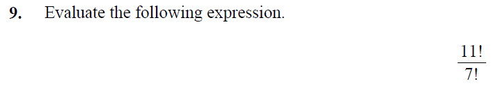

**_Solution:_**

$\frac{11!}{7!}$ = $\frac{11*10*9*8*7!}{(7!)}$ = $`r factorial(11)/factorial(7)`$

Using _R_ factorial function

```{r,echo=T}
factorial(11)/factorial(7)
```

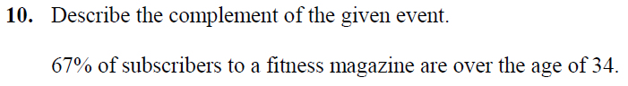

**_Solution:_**

Percentage of subscribers over age 34 $S_{age > 34}$= 67% = $\frac{67}{100}$ = 0.67

Complement would be group of subscribers age 34 or under = $S_{age \le 34}$

Also, sum of non-complement and complement should be equal to 1

Hence, $S_{age > 34}$ + $S_{age \le 34}$ = 1

= $0.67 + S_{age \le 34} = 1$ 

= $S_{age \le 34} = `r 1 -0.67`$

Therefore, complement of subscribers over age 34 = $S_{age \le 34} = `r 1 -0.67`$

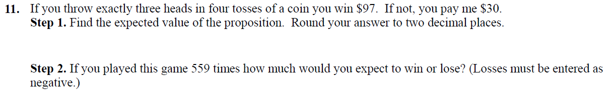

**_Solution:_**

Outcomes of each coin toss = 2, if we assume that each coin toss is equally likely to come up heads or tails, then for four tosses there would be $16(2 * 2 * 2 * 2)$ outcomes.

Out of 4 coin tosses, we can get 3 heads in any combination. Total combinations we get heads = $4_{C_3}$ = $\frac{4!}{3!(4-3)!}$ = $`r choose(4,3)`$

Probability of getting three heads in four tosses = $\frac {\bigg(4_{C_3}\bigg)}{outcomes\ of\ four\ tosses}$

= $\frac {`r choose(4,3)`}{16}$ = $`r round(choose(4,3)/16,2)`$

There is $`r (round(choose(4,3)/16,2)) * 100` \%$ or one in four chances of winning $\$97$ and $`r (1 -(round(choose(4,3)/16,2))) * 100` \%$ or three in four chances of losing $\$30$.

**_Step 2._** If 559 games are played, each win makes $\$97$ and for each loss, lose $\$30$.

Using _R_ functions
```{r, echo=T}
options(scipen = 10, digits = 4)
coin.toss<- c(rep('H',4),rep('T',4))

#sample size
n<- 559

#vector holds samples
output<- rep(-1, n)

# select four jellybeans without replacement
for(i in 1:n){
  sampleout = sample(coin.toss, 4, replace=F)
  if (length(sampleout[sampleout=='T'])==1 & length(sampleout[sampleout=='H'])==3)
  {
    output[i]<- 1
  }
}

#check wins and loss
prob.wins<- output[output==1]
prob.wins<- length(prob.wins)

prob.loss<- output[output==-1]
prob.loss<- length(prob.loss)

#for success, if you get 3 heads from 4 tosses win 
success<- prob.wins * 97
loss<- prob.loss * 30
```

Probability of getting exactly 3 heads from 4 tosses in 559 plays: $`r round((prob.wins/n) * 100,2)` \%$.

Amount won: $\$`r success`$. Amount lost: $-\$`r loss`$

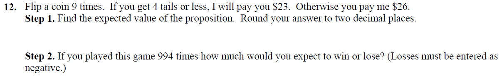

**_Solution:_**

Outcomes of each coin toss = 2, if we assume that each coin toss is equally likely to come up heads or tails, then for nine tosses there would be $`r 2^9`(2^9)$ outcomes.

Out of 9 coin tosses, we can get four or less tails in any combination. Total combinations we get tails = $9_{C_4}$ + $9_{C_3}$ + $9_{C_2}$ + $9_{C_1}$ = $\frac{9!}{4!(9-4)!} + \frac{9!}{3!(9-3)!}  + \frac{9!}{2!(9-2)!}  + \frac{9!}{1!(9-1)!}$ = $`r choose(9,4)` + `r choose(9,3)` + `r choose(9,2)` + `r choose(9,1)`$ = $`r choose(9,4) + choose(9,3) + choose(9,2) + choose(9,1)`$

Probability of getting four or less tails in 9 tosses = $\frac {\bigg(9_{C_4}\bigg) + \bigg(9_{C_3}\bigg) + \bigg(9_{C_2}\bigg) + \bigg(9_{C_1}\bigg)}{outcomes\ of\ nine\ tosses}$

= $\frac {`r choose(9,4) + choose(9,3) + choose(9,2) + choose(9,1)`}{`r 2^9`}$ = $`r round((choose(9,4) + choose(9,3) + choose(9,2) + choose(9,1))/2^9,4)`$

There is $`r (round((choose(9,4) + choose(9,3) + choose(9,2) + choose(9,1))/2^9,4)) * 100` \%$ or little less than one in 2 chances of winning $\$23$ and $`r (1 -round((choose(9,4) + choose(9,3) + choose(9,2) + choose(9,1))/2^9,4)) * 100` \%$ or little more than one in two chances of losing $\$26$.

**_Step 2._** If 994 games are played, each win makes $\$23$ and for each loss, lose $\$26$.

Using _R_ functions
```{r, echo=T}
options(scipen = 10, digits = 4)
coin.toss<- c(rep('H',9),rep('T',9))

#sample size
n<- 994

#vector holds samples
output<- rep(-1, n)

# select four jellybeans without replacement
for(i in 1:n){
  sampleout = sample(coin.toss, 9, replace=F)
  if (length(sampleout[sampleout=='T']) < 5)
  {
    output[i]<- 1
  }
}

#check wins and loss
prob.wins<- output[output==1]
prob.wins<- length(prob.wins)

prob.loss<- output[output==-1]
prob.loss<- length(prob.loss)

#for success, if you get 3 heads from 4 tosses win 
success<- prob.wins * 23
loss<- prob.loss * 26
```

Probability of getting exactly four or less tails from 9 tosses in 994 plays: $`r round((prob.wins/n) * 100,2)` \%$.

Amount won: $\$`r success`$. Amount lost: $-\$`r loss`$

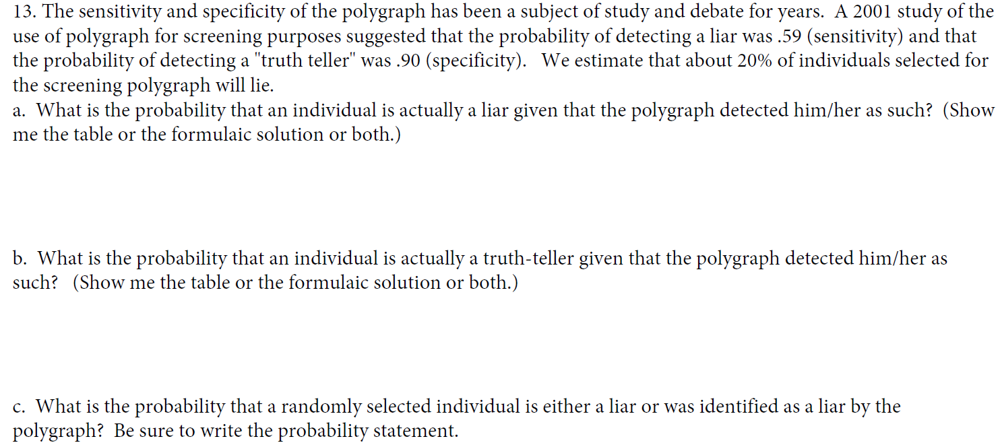

**_Solution:_**

Based on wikipedia _confusion matrix_ is defined as,

```{r, echo=T}
cm<- matrix(NA, nrow=2, ncol=2)

cm<- matrix(c('True Positive(TP)','False Negative(FN)(Type II Error)', 'False Positive(FP)(Type I Error)','True Negative(TN)'), nrow=2, ncol=2)
rownames(cm) <- c('Predict Liar', 'Predict Truth Teller')
kable(cm, col.names = c("Actual Liar", "Actual Truth Teller"), align = "l")
```

Given sensitivity = 0.59, specificity = 0.90.

True Positive Rate($TPR$) = $\frac{TP}{TP+FN}$ = $1 - FNR$ = $sensitivity$ = $0.59$, probability that the polygraph will identify actual liar as a liar. In other words polygraph will predict a individual as liar correctly 59% of the time. 

False Negative Rate($FNR$) = $\frac{FN}{TP+FN}$ = Type II Error Rate = $1 - sensitivity$ = $1 - 0.59$ = $`r 1 - 0.59`$, probability that polygraph will identify actual liar as a truth-teller.

True Negative Rate($TNR$) = $\frac{TN}{FP+TN}$ = $1 - FPR$ = $specificity$= $0.90$, probability that the polygraph will identify actual truth-teller as a truth-teller. In other words polygraph will predict a individual as truth-teller correctly 90% of the time.

False Positive Rate($FPR$) = $\frac{FP}{FP+TN}$ = Type I Error Rate = $1 - specificity$ = $1 - 0.90$ = $`r 1 - 0.90`$, probability that polygraph will identify actual truth-teller as a liar

```{r,echo=T}
options(scipen = 10, digits = 8)
#TPR is also known are sensitivity
#probability that the polygraph will identify actual liar as a liar
TPR<- 0.59
#TNR is also known are specificity
#probability that the polygraph will identify actual truth-teller as a truth-teller
TNR<- 0.90
#FNR is also known as Type II Error rate
#probability that polygraph will identify actual liar as a truth-teller 
FNR<- 1 - TPR
#FPR is also known as Type I Error rate
#probability that polygraph will identify actual truth-teller as a liar
FPR<- 1 - TNR

cm<- matrix(c(TPR,FNR, FPR,TNR), nrow=2, ncol=2)
rownames(cm)<- c('Predict Liar', 'Predict Truth Teller')
kable(cm, digits = 2, col.names = c("Actual Liar", "Actual Truth Teller"), align = "l")
```

For a given sample population 20% of individuals selected for the screening polygraph will lie. Liars = 0.20 and truth-tellers = 0.80.

If we use polygraph on the sample population, it will correctly predict 59% as liars and 41% as truth-tellers of 20% of liars from the sample population.

Liars from sample population = 20%

Polygraph perdiction for liars = $20\% * 59\%$ = $`r (0.20 * 0.59) * 100`\%$

Polygraph perdiction for truth-tellers(even though they are actual liars), Type II Error = $20\% * (100 - 59)\%$ = $`r 0.20 * (1 - .59) * 100`\%$

For truth-tellers, polygraph will predict 90% as truth-tellers and 10% as liars of 80% of truth-tellers from sample population

Truth-tellers from sample population = 80%

Polygraph perdiction for truth-tellers = $80\% * 90\%$ = $`r (0.80 * 0.90) * 100`\%$

Polygraph perdiction for liars(even though they are actual truth-tellers), Type I Error = $80\% * (100 - 90)\%$ = $`r 0.80 * (1 - 0.90) * 100`\%$

```{r,echo=T}
options(scipen = 10, digits = 8)
#sample population size
n<-1.00
#population split
actual.liars<- n * 0.20
actual.truth.tellers<- n * 0.80

#polygraph prediction from actuals
#true positives
predict.liars<- actual.liars * 0.59
#type II error
predict.truth.tellers.II<- actual.liars * (1 - 0.59)

#true negatives
predict.truth.tellers<- actual.truth.tellers * 0.90
#type I error
predict.liars.I<- actual.truth.tellers * (1 - 0.90)

#generate matrix
poly.data<- matrix(c(predict.liars,predict.truth.tellers.II, predict.liars.I,predict.truth.tellers), nrow=2, ncol=2)

#add column and row totals
poly.data<- cbind(poly.data, Total = rowSums(poly.data))
poly.data<- rbind(poly.data, Total = round(colSums(poly.data),4))
rownames(poly.data)<- c('Predict Liar', 'Predict Truth Teller','Total')
kable(poly.data, digits = 4, col.names = c("Actual Liar", "Actual Truth Teller","Total"), caption = "Sample Population", align="l")
```

**_a. What is the probability that an individual is actually a liar given that the polygraph detected him/her as such? (Show me the table or the formulaic solution or both.)_**

```{r, echo=T, message=F, warning=F}
options(scipen = 10, digits = 8)
#venn diagram for Liars
venndiag<- draw.pairwise.venn(area1 = poly.data[1,3], area2 = poly.data[3,1], cross.area = poly.data[1,1], category = c(paste0("Predicted Liars (",poly.data[1,3],")"),paste0("Acutal Liars (",poly.data[3,1],")")), fill = c("red", "blue"),cat.pos = c(0, 180), rotation.degree = 180, scaled = FALSE, ind=FALSE)

#add heading to venn diagram
grid.arrange(gTree(children=venndiag), top="Venn Diagram - Liars")
```

Using Bayes theorem,  

$P(E_1|E) = \frac{P(E_1 \cap E)}{P(E_1 \cap E) + P(E_2 \cap E)}$, 

$P(E_1 \cap E)$ represents sample population that actually lied and polygraph predicted as liars.

$P(E_1 \cap E) = `r poly.data[1,1]`$

$P(E_2 \cap E)$ represents entire sample population that polygraph predicted as liars.

$P(E_2 \cap E) = `r poly.data[1,2]`$

$P(E_1|E)$ =  $P$(individual actually lied _given_ polygraph predicted as liar)

$P(E_1|E)$ = $\frac{`r poly.data[1,1]`}{`r poly.data[1,1]` + `r poly.data[1,2]`}$ = $`r round(poly.data[1,1]/(poly.data[1,1] + poly.data[1,2]),4)`$

Probability that an individual is actually a liar given that the polygraph predicted as liar = $`r round(poly.data[1,1]/(poly.data[1,1] + poly.data[1,2]),4)`$

**_b. What is the probability that an individual is actually a truth-teller given that the polygraph detected him/her as such? (Show me the table or the formulaic solution or both.)_**


```{r, echo=T, message=F, warning=F}
options(scipen = 10, digits = 8)

#venn diagram for Truth-tellers
venndiag<- draw.pairwise.venn(area1 = poly.data[2,3], area2 = poly.data[3,2], cross.area = poly.data[2,2], category = c(paste0("Predicted Truth Tellers (",poly.data[2,3],")"),paste0("Acutal Truth Tellers (",poly.data[3,2],")")), fill = c("yellow", "blue"),cat.pos = c(0, 180), rotation.degree = 180, scaled = FALSE, ind=FALSE)

#add heading to venn diagram
grid.arrange(gTree(children=venndiag), top="Venn Diagram - Truth Tellers")
```

Using Bayes theorem,  

$P(E_1|E) = \frac{P(E_1 \cap E)}{P(E_1 \cap E) + P(E_2 \cap E)}$, 

$P(E_1 \cap E)$ represents sample population that actually is truth-teller and polygraph predicted as a truth-tellers.

$P(E_1 \cap E) = `r poly.data[2,2]`$

$P(E_2 \cap E)$ represents entire sample population that polygraph predicted as truth-tellers.

$P(E_2 \cap E) = `r poly.data[2,1]`$

$P(E_1|E)$ =  $P$(individual actually is a truth-teller _given_ polygraph predicted as truth-teller)

$P(E_1|E)$ = $\frac{`r poly.data[2,2]`}{`r poly.data[2,1]` + `r poly.data[2,2]`}$ = $`r round(poly.data[2,2]/(poly.data[2,1] + poly.data[2,2]),4)`$

Probability that an individual is actually a truth-teller given that the polygraph detected as truth-teller = $`r round(poly.data[2,2]/(poly.data[2,1] + poly.data[2,2]),4)`$

**_c. What is the probability that a randomly selected individual is either a liar or was identified as a liar by the polygraph? Be sure to write the probability statement._**

Total actual liars $P(A)= 20\% = 0.20$

Total polygraph identified liars $P(I) = 19.8\% = 0.198$

Total actual liars and polygraph identified liars $P(A) \cap P(I) = 11.8\% = 0.118$

The probability that a randomly selected individual is either a liar or was identified as a liar by the polygraph is $P(A\ or\ I) = P(A) + P(I) - P(A) \cap P(I)$. We have subtracted $P(A) \cap P(I)$ as it is counted twice.

$P(A\ or\ I) = 0.20 + 0.198 - 0.118 = `r 0.20 + 0.198 - 0.118`$

Probability that a randomly selected individual is either a liar or was identified as a liar by the polygraph = $`r 0.20 + 0.198 - 0.118`$

References:

- https://www.khanacademy.org/math/precalculus/prob-comb/prob-combinatorics-precalc/v/getting-exactly-two-heads-combinatorics
- http://www.montereyinstitute.org/courses/Algebra1/COURSE_TEXT_RESOURCE/U12_L2_T4_text_container.html
- https://en.wikipedia.org/wiki/Confusion_matrix
- https://en.wikipedia.org/wiki/Sensitivity_and_specificity
- https://en.wikipedia.org/wiki/Likelihood_ratios_in_diagnostic_testing#negative_likelihood_ratio
- https://math.stackexchange.com/questions/2134329/lie-detector-test-help
- https://www.intmath.com/counting-probability/10-bayes-theorem.php

